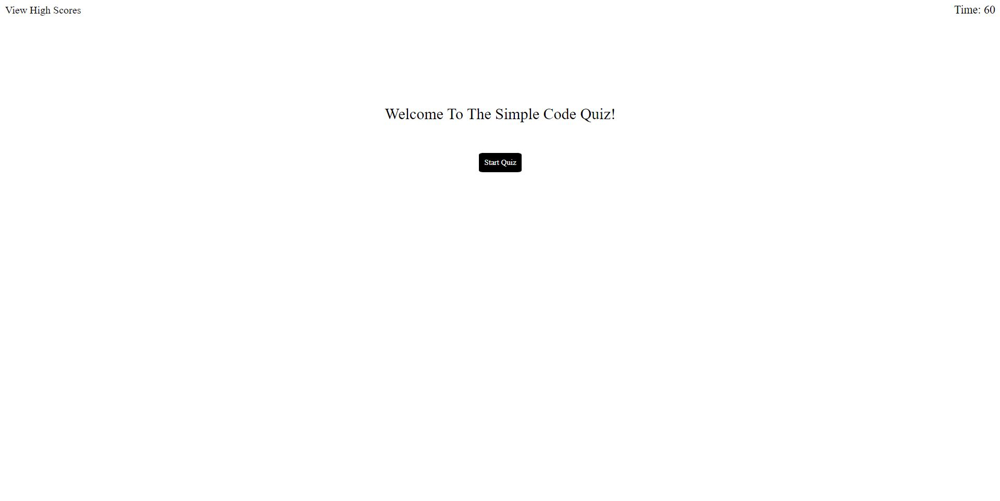
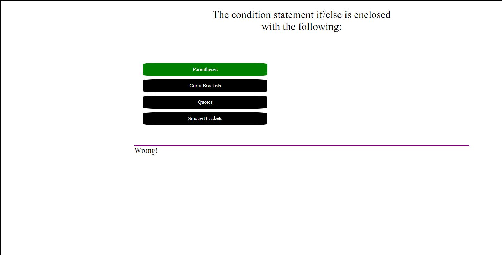
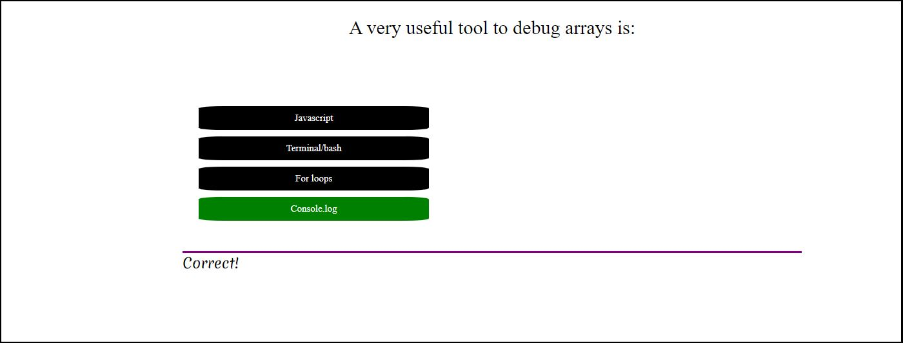
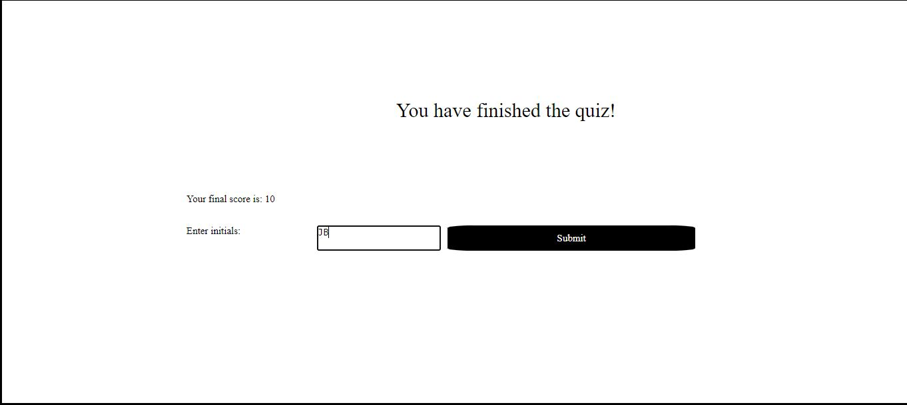
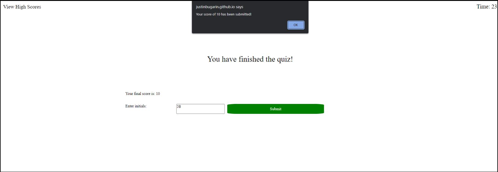
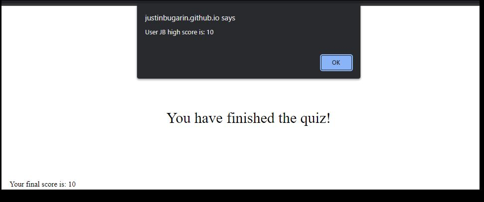

Module 4 Challenge : Code Quiz links:

https://github.com/JustinBugarin/Challenge4Quiz

Live Repo:

https://justinbugarin.github.io/Challenge4Quiz/

We were tasked to make a code quiz with certain criterias that allows the user to:

Start the quiz when the button is clicked and given a timer and question:

After clicking an answer, the user is told that the answer they picked is right or wrong

and when all the questions are answered or the timer hits 0, the game ends and lets the user saves their initial and score.

